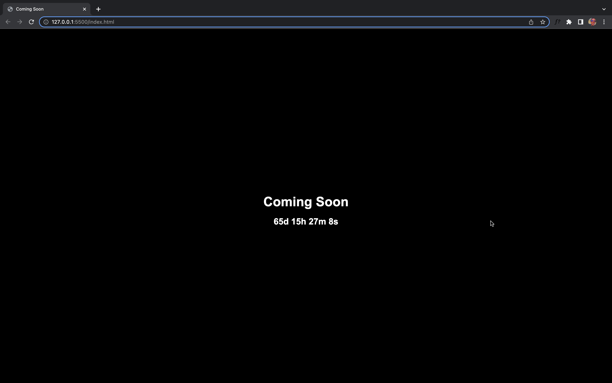

# Coming Soon Page

A simple "Coming Soon" page with a countdown timer, built using HTML, CSS, and JavaScript.

## Table of Contents

- [Introduction](#introduction)
- [Features](#features)
- [How to Use](#how-to-use)
- [Customization](#customization)
- [Contributing](#contributing)

## Introduction

The "Coming Soon" page is a web page designed to inform visitors that your website, product, or service is in development and will be launched soon. It features a countdown timer that dynamically displays the time remaining until the launch date.

## Features

- Informative "Coming Soon" message with a stylish design.
- Real-time countdown timer to the specified launch date.
- Fully responsive layout for different screen sizes and devices.

## How to Use

1. Clone this repository to your local machine using the following command:

   `git clone https://github.com/casmir293/Coming-Soon-Page.git`

2. Navigate to the project directory:

   `cd Coming-Soon-Page`

3. Open the `index.html` file in your web browser.

The "Coming Soon" page will be displayed with the countdown timer running until the launch date you specified in the `script.js` file.

## Customization

You can customize the "Coming Soon" page to suit your preferences:

1. Change the launch date: In the `script.js` file, modify the `launchDate` variable with your desired launch date and time in the format `YYYY-MM-DD HH:MM:SS`.

2. Adjust the styles: To change the visual appearance, update the CSS rules in the `styles.css` file.

3. Add more content: Expand the HTML structure in the `index.html` file to include additional information, such as a sign-up form or social media links.

## Contributing

Contributions are welcome! If you find any issues or have suggestions for improvements, please feel free to open an issue or create a pull request.
